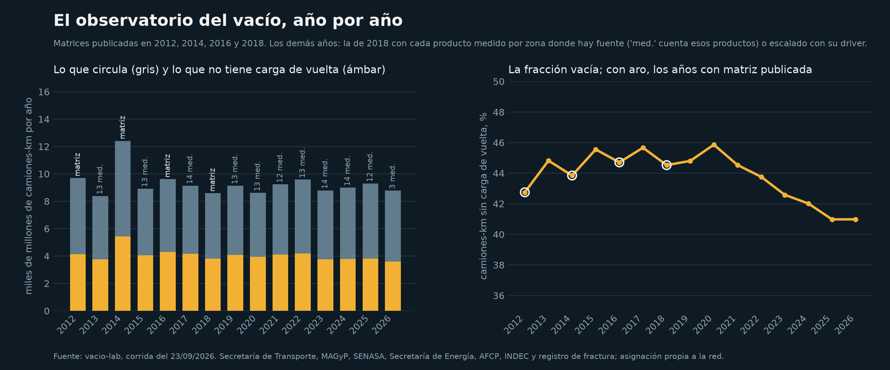
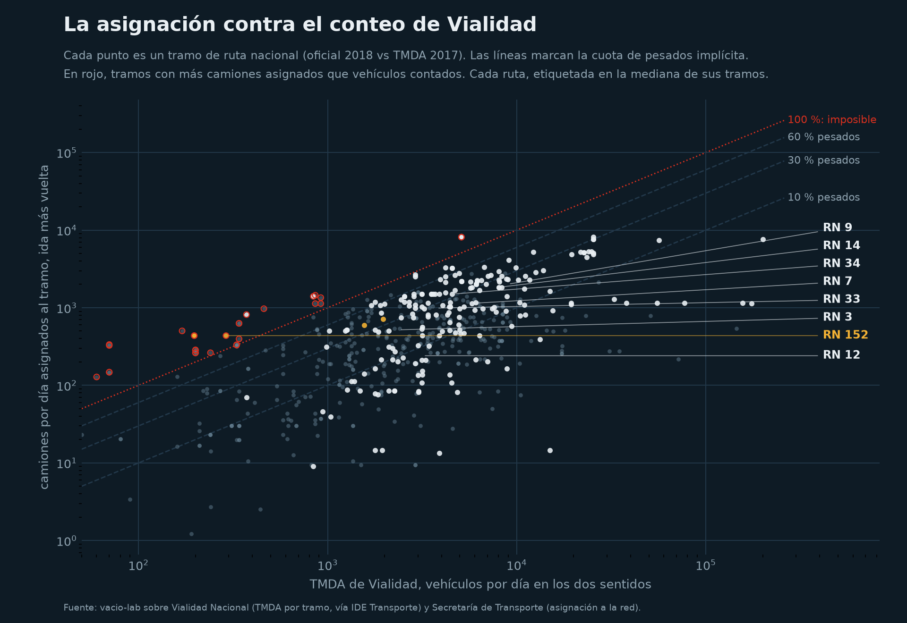

# vacio-lab

El mapa del vacío: cuánto del transporte de cargas argentino vuelve sin carga,
tramo por tramo y producto por producto, con las matrices origen-destino de la
Secretaría de Transporte. Octavo repo de la serie Sur Analytics y el segundo de
logística, después de la ruta de la arena.

> En 2018, el 43 % de los camiones-kilómetro de las rutas argentinas se hizo
> en un sentido que no tiene carga de vuelta. No es un problema de
> información: es la forma de la economía. Este repo lo mide con los datos
> oficiales y muestra dónde está, cuánto es y qué cargas podrían emparejarse.


El mapa interactivo, con cada tramo, sus camiones por sentido y su estado de
pavimento: <https://dpinero14.github.io/vacio-lab/mapa_vacio.html>

## Qué hace

| Notebook | Qué hace |
|---|---|
| `01_el_mapa_del_vacio` | Lee las matrices origen-destino de 2012 a 2018 (123 zonas, 113 productos, en toneladas y en camiones) y la red vial con el flujo de camiones por sentido. Mide el vacío estructural por par de zonas, por producto y por tramo de ruta. Toma la arena de fractura como caso extremo y busca qué podría volver cargado desde Neuquén. Dibuja el mapa. |
| `02_el_vacio_en_el_tiempo` | Asigna las matrices a la red con rutas mínimas y valida el método contra la asignación oficial de 2018. Lleva el vacío hacia atrás con las matrices reales de 2012, 2014 y 2016, y hacia adelante escalando cada producto de 2018 con series abiertas (cosecha, ventas de combustibles, cemento, industria) y sumando la arena de fractura que la matriz no veía. Vacío por tramo y por año, 2012 a 2026, las rutas de la arena y el mapa animado. |

| `scripts/observatorio.py` | No es un notebook: es la corrida que se repite sola. Para cada año arma la matriz con lo que se mide por zona (producción por departamento, hacienda entre departamentos, ventas por estación de servicio, cemento por provincia, arena bombeada) y el driver nacional donde no hay fuente, la asigna a la red, la valida contra los conteos de Vialidad y publica la página del observatorio. |

Las funciones están en `src/vlab/`: `od.py` lee las planillas, que cambian de
formato en cada edición, y mide el desbalance por par; `network.py` carga la
red y mide el vacío por tramo; `assign.py` asigna una matriz a la red;
`drivers.py` trae las series que mueven cada carga; `projection.py` escala la
matriz y suma la arena; `sources.py` y `zoning.py` leen las fuentes que miden
por zona y las llevan a las 123 zonas; `graduate.py` reemplaza el factor
nacional por uno por zona cuando hay fuente; `validate.py` compara la
asignación con el TMDA de Vialidad; `panel.py` procesa el panel de flotas;
`maps.py` y `figures.py` dibujan. Todo testeado con matrices y redes
sintéticas; el notebook narra.

## Qué encontramos

**El 43 % de los camiones-kilómetro se hace en el sentido sin carga de
vuelta.** La red simplificada tiene 1.731 tramos y 58.000 km, con los camiones
por año asignados en cada sentido. La diferencia entre la ida y la vuelta de
cada tramo, multiplicada por su largo, suma 3.460 millones de camiones-km por
año sobre 8.110 millones. Ese vacío no lo arregla ninguna aplicación de
matching: es un camión que llevó soja al puerto y no tiene soja que traer.

Conviene leer bien ese 43 %. La matriz solo cuenta viajes cargados: por cada
100 camiones cargados que cruzan un tramo en un sentido, 43 no tienen un
camión cargado que lo cruce en el otro. Si cada uno de esos vuelve vacío por
la misma ruta, los kilómetros vacíos son el 43 % de los cargados, o sea 3 de
cada 10 kilómetros de camión en total. Es la cifra comparable con el 21,6 %
de vehículo-kilómetros vacíos que mide Eurostat en la Unión Europea. No es
"el 43 % de los camiones vuelve vacío": un camión puede triangular a un tercer
destino, y dos cargas que se cruzan en un tramo pueden no compartir el mismo
equipo.

| Ruta | km | Camiones-km por año | Vacíos | % |
|---|---|---|---|---|
| RN 9 | 1.926 | 1.323 M | 519 M | 39 |
| RN 3 | 3.108 | 786 M | 435 M | 55 |
| RN 34 | 1.329 | 904 M | 327 M | 36 |
| RN 14 | 1.048 | 521 M | 285 M | 55 |
| RN 33 | 791 | 297 M | 224 M | 75 |
| RN 12 | 1.579 | 284 M | 142 M | 50 |
| RN 40 | 4.979 | 188 M | 123 M | 66 |

**Por producto es peor.** Medido par por par y producto por producto, el 95 %
de las 245 millones de toneladas que cruzaron entre zonas en 2018 no tuvo carga
del mismo producto de vuelta en el mismo par. El total de un tramo mezcla cargas
que no comparten camión. Medido grupo por grupo con la misma red: granos 86 % vacío, carnes
81 %, economías regionales 80 %, minería 76 %, combustibles 64 %,
semiterminados 68 %, industrializados 56 %.

**La arena de fractura es el caso extremo, y la estadística no la ve.** La
matriz oficial de 2018 tiene una hoja de arena silícea: 1,7 millones de
toneladas en el país, con destino Buenos Aires en su mayoría, y unas 40.000
hacia Neuquén y el Alto Valle. El registro de fractura del mismo año, de la
Secretaría de Energía, dice 934.000 toneladas bombeadas en Vaca Muerta. La
matriz con la que se planifican las rutas capta menos del 5 % del flujo de
carga nuevo más grande de la década.

**Qué podría volver cargado desde Neuquén.** Era la pregunta abierta de la
ruta de la arena. Con las 111 matrices de 2018: de Neuquén y el Alto Valle
salen 5,8 millones de toneladas por año hacia el resto del país, y entran 2,6.
Lo que más sale son combustibles, 3,9 millones, y van al sur, a Comodoro
Rivadavia, Trelew y Río Gallegos, en cisterna: dirección y equipo contrarios a
la batea de arena que vuelve al norte. Lo que sí va al norte son las peras y
manzanas del Alto Valle, casi un millón de toneladas, en pallets y con frío.
El vacío de la arena es estructural dos veces: por dirección y por equipo.

## El vacío en el tiempo

**La fracción vacía no cambia con el ciclo; el volumen sí.** Con las matrices
reales de 2012, 2014, 2016 y 2018 asignadas a la red, y de 2019 en adelante la
matriz de 2018 escalada producto por producto con series abiertas, la red va
del 42,7 al 45,4 % de camiones-kilómetro sin carga de vuelta en quince años.
Lo que se mueve es cuánto circula: 12,4 mil millones de camiones-km en 2014,
8,5 en el pozo de 2020 y en la sequía de 2023, 9,4 en 2025.


**La asignación propia reproduce la oficial, y la arena sola encuentra su
ruta.** Comparada con la asignación de la Secretaría para 2018: correlación
0,86 por tramo, 5 % más de camiones-kilómetro, sentido correcto en la mayoría.
Y sin que nadie se lo indique, la asignación manda la arena de Entre Ríos a
Neuquén por la RN 152: 558 camiones cargados por día en 2025, contra 561 de
arena-lab con otro método y las 1.200 pasadas que cuenta La Pampa.

**Un mismo flujo agranda el vacío en una ruta y lo achica en la siguiente.**
Entre 2018 y 2025 la RN 152 pasa de 60 a 73 % vacía y la RN 5 de 14 a 40 %,
porque la arena va en el sentido que ya estaba cargado. Pero la RN 151 baja de
40 a 15 % y la RN 35 de 57 a 42 %: ahí la arena viaja en el sentido que antes
volvía vacío, y lo llena.

**El vacío nuevo más grande no es el de la arena.** Son los accesos a Rosario
y las rutas de Entre Ríos, RN 33, RN 14 y RN 12, empujados por una cosecha de
soja un 35 % mayor que la de 2018. La arena aparece en los mismos tramos de
Entre Ríos con un 11 a 12 % del tránsito. El grano sigue siendo el vacío del
país; la arena es el vacío de un corredor.


Todo lo de 2019 en adelante es un escenario, no una medición, y así se marca
en cada figura.

## El observatorio

La página <https://dpinero14.github.io/vacio-lab/observatorio.html> se
rehace sola una vez por mes (GitHub Actions) con lo que hay publicado. La
diferencia con la proyección del notebook 02 es la *graduación*: un producto
deja de escalarse con un factor nacional cuando una fuente abierta lo mide
zona por zona. En 2025 son 12 productos: los granos por la producción de
cada departamento (MAGyP), el gasoil y la nafta por los volúmenes de cada
estación de servicio (Secretaría de Energía), el cemento por el consumo de
cada provincia (AFCP) y la arena por el registro de fractura; entre 2013 y
2017, además, la hacienda en pie por los movimientos entre departamentos
(SENASA), que mide las dos puntas y se ajusta por IPF. Otros 38 productos
siguen con su driver nacional y 62 quedan planos, y la página lo declara.



Con la graduación, la fracción sin carga de vuelta de 2025 da 41 %, contra
el 43 % de la proyección con factores nacionales. La diferencia viene de
escalar cada zona por lo suyo en lugar de todo el país por un mismo factor;
qué producto la explica no se investigó todavía. Son dos puntos sobre una
serie que se mueve entre 41 y 46 en quince años: la lectura de fondo no
cambia.

**La asignación contra Vialidad.** Vialidad Nacional publica el tránsito
medio diario por tramo (TMDA, todos los vehículos). Sobre 656 tramos
apareados, la asignación oficial de 2018 implica una cuota de pesados
mediana del 15 % (entre 25 y 41 % en las rutas de carga: RN 188, RN 14,
RN 33, RN 34), una correlación de rangos de 0,59 con el conteo y 32 tramos
imposibles, con más camiones asignados que vehículos contados, un tercio de
ellos en la RN 40. La correlación es 0,86 en la RN 9 y la RN 33, 0,85 en la
RN 14, y cae a 0,06 en la RN 40. Vialidad no publica la composición por
categoría, así que es una verificación de orden de magnitud, no una
calibración.



**Lo que falta y se pidió.** `PEDIDOS.md` tiene los tres pedidos listos para
enviar: la matriz 2022 del CESPA, los viajes de granos de la Carta de Porte
Electrónica (ARCA) y las matrices posteriores a 2018, las encuestas en ruta y
los conteos por categoría de la Secretaría de Transporte (Ley 27.275).

**El panel de flotas.** El camión vacío real no lo mide nadie en Argentina.
La carpeta `panel/` propone la versión mínima de la encuesta continua del
Reino Unido: una semana de viajes por vehículo, cargado o vacío, con una
regla fija de publicación (ningún número con menos de tres flotas detrás).

## Datos

Todo abierto y verificado el 22 de septiembre de 2026: ver `data/README.md`.
`python scripts/download_data.py` baja unos 215 MB a `data/raw/`. Las zonas
se geocodifican una vez con OpenStreetMap y quedan en `centroides_zonas.json`.

## Cómo correrlo

El observatorio completo: `python scripts/download_data.py` (cerca de 1,5 GB
con las fuentes por zona), `python scripts/observatorio.py --anios 2012-2026`
y `python scripts/build_page.py`. Los notebooks:

```
python -m venv .venv
.venv\Scripts\python.exe -m pip install -r requirements.txt
.venv\Scripts\python.exe -m ipykernel install --user --name vacio-lab --display-name "vacio-lab"
.venv\Scripts\python.exe scripts/download_data.py
.venv\Scripts\python.exe -m pytest -q tests
.venv\Scripts\python.exe -m jupyter nbconvert --to notebook --execute --inplace notebooks/01_el_mapa_del_vacio.ipynb
```

## Limitaciones

- La última matriz publicada es de 2018. De 2019 en adelante la estructura
  de orígenes y destinos es la de 2018: en el observatorio, 12 a 14 productos
  se escalan zona por zona con una fuente que los mide, 38 con un driver
  nacional y 62 quedan planos. El notebook 02 usa solo factores nacionales.
- La graduación mide una punta por producto (el origen de los granos, el
  destino de los combustibles y el cemento); la otra queda con la forma de
  2018. Solo la hacienda de 2013 a 2017 tiene las dos puntas medidas.
- La validación contra el TMDA es de orden de magnitud: Vialidad no publica
  la composición por categoría y el último conteo por tramo es de 2017.
- La asignación propia difiere de la oficial en un 5 % de camiones-kilómetro y
  tiene menos detalle en los accesos urbanos. Las ediciones de 2012 a 2016
  cambiaron de método entre sí; el salto de 2014 puede ser de método.
- La matriz es una estimación oficial a partir de registros administrativos
  (SENASA, cartas de porte, permisos) y modelos, asignada a una red vial
  simplificada. No es un conteo de camiones.
- El vacío por tramo se calcula sobre el total de productos; por producto es
  mayor, y por equipo, más todavía: una tolva no lleva pallets.
- Las zonas son 123 grupos de departamentos con un centroide geocodificado en
  OpenStreetMap. Lo intrazonal queda afuera del vacío estructural.
- Un desbalance en toneladas no es un camión vacío exacto: la conversión a
  camiones usa densidades por producto que hace la propia Secretaría.

## Próximos pasos

- Sumar la matriz 2022 del CESPA y la Carta de Porte Electrónica cuando
  lleguen (`PEDIDOS.md`), y las primeras semanas del panel de flotas.
- Contar camiones desde el satélite: satelite-lab usa el desfase entre bandas
  de Sentinel-2 para contar vehículos en movimiento por ruta y sentido, un
  conteo independiente de la matriz.
- El mismo notebook sobre la matriz FAF5 de Estados Unidos y los datos de
  Eurostat, donde el 21,6 % de los vehículo-km se hace vacío.
- Cruzar el vacío con el estado del pavimento, que viene en el mismo dato.

## Datos y licencias

- Secretaría de Transporte, *Matriz Origen-Destino vial de Transporte de
  Cargas*, ediciones 2012, 2014, 2016 y 2018, y su informe metodológico:
  <https://datos.transporte.gob.ar/dataset/matriz-od-vial-cargas>
- IDE Transporte, capas `Carga transportada ... 2018` por WFS:
  <https://ide.transporte.gob.ar/geoserver>
- API de series de tiempo de datos.gob.ar (Secretaría de Energía, AFCP, INDEC, ADEFA) y estimaciones agrícolas del MAGyP
  (datos.magyp.gob.ar), como drivers de la proyección.
- Secretaría de Energía, registro de fractura por pozo (Adjunto IV), usado
  para la comparación de la arena y como driver: <http://datos.energia.gob.ar/dataset/datos-de-fractura-de-pozos-adjunto-iv>
- Fuentes del observatorio: MAGyP, estimaciones agrícolas por departamento;
  SENASA, movimientos de bovinos entre departamentos (2013 a 2018), publicado
  por MAGyP; Secretaría de Energía, precios y volúmenes por estación de
  servicio (Res. 1104/04); AFCP, consumo de cemento por provincia (páginas
  mensuales, desde 2021); Vialidad Nacional vía IDE Transporte, TMDA 2016 y
  2017 por tramo y estaciones de conteo 2019; API georef de datos.gob.ar.
- Geocodificación de centroides: OpenStreetMap, Nominatim (ODbL).

Código con licencia MIT.

## Autor

Diego Piñero, Sur Analytics.
