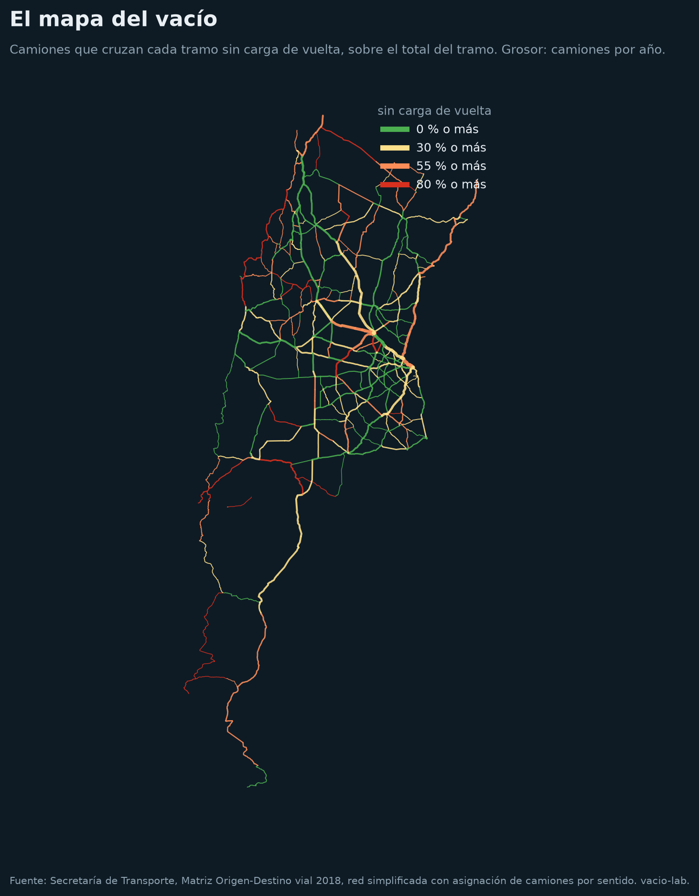
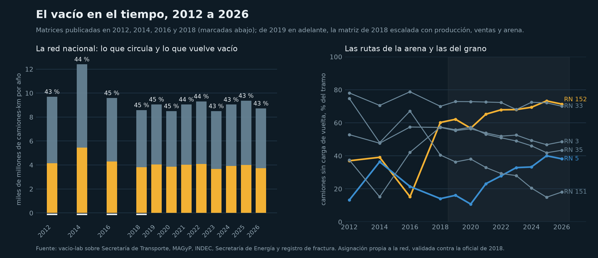
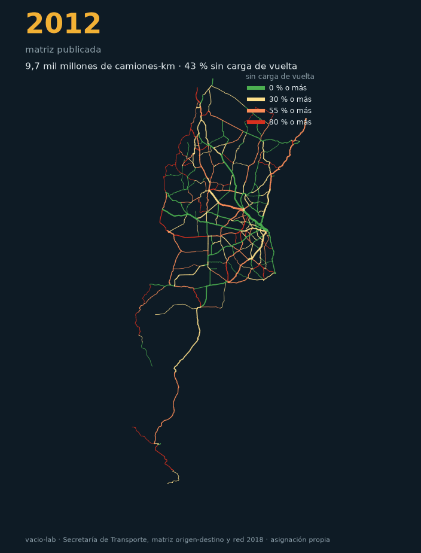

# vacio-lab

El mapa del vacío: cuánto del transporte de cargas argentino vuelve sin carga,
tramo por tramo y producto por producto, con las matrices origen-destino de la
Secretaría de Transporte. Octavo repo de la serie Sur Analytics y el segundo de
logística, después de la ruta de la arena.

> En 2018, el 43 % de los camiones-kilómetro de las rutas argentinas se hizo
> en un sentido que no tiene carga de vuelta. No es un problema de
> información: es la forma de la economía. Este repo lo mide con los datos
> oficiales y muestra dónde está, cuánto es y qué cargas podrían emparejarse.



El mapa interactivo, con cada tramo, sus camiones por sentido y su estado de
pavimento: <https://dpinero14.github.io/vacio-lab/mapa_vacio.html>

## Qué hace

| Notebook | Qué hace |
|---|---|
| `01_el_mapa_del_vacio` | Lee las matrices origen-destino de 2012 a 2018 (123 zonas, 113 productos, en toneladas y en camiones) y la red vial con el flujo de camiones por sentido. Mide el vacío estructural por par de zonas, por producto y por tramo de ruta. Toma la arena de fractura como caso extremo y busca qué podría volver cargado desde Neuquén. Dibuja el mapa. |
| `02_el_vacio_en_el_tiempo` | Asigna las matrices a la red con rutas mínimas y valida el método contra la asignación oficial de 2018. Lleva el vacío hacia atrás con las matrices reales de 2012, 2014 y 2016, y hacia adelante escalando cada producto de 2018 con series abiertas (cosecha, ventas de combustibles, cemento, industria) y sumando la arena de fractura que la matriz no veía. Vacío por tramo y por año, 2012 a 2026, las rutas de la arena y el mapa animado. |

Las funciones están en `src/vlab/`: `od.py` lee las planillas, que cambian de
formato en cada edición, y mide el desbalance por par; `network.py` carga la
red y mide el vacío por tramo; `assign.py` asigna una matriz a la red;
`drivers.py` trae las series que mueven cada carga; `projection.py` escala la
matriz y suma la arena; `maps.py` y `figures.py` dibujan. Todo testeado con matrices y
redes sintéticas; el notebook narra.

## Qué encontramos

**El 43 % de los camiones-kilómetro se hace en el sentido sin carga de
vuelta.** La red simplificada tiene 1.731 tramos y 58.000 km, con los camiones
por año asignados en cada sentido. La diferencia entre la ida y la vuelta de
cada tramo, multiplicada por su largo, suma 3.460 millones de camiones-km por
año sobre 8.110 millones. Ese vacío no lo arregla ninguna aplicación de
matching: es un camión que llevó soja al puerto y no tiene soja que traer.

| Ruta | km | Camiones-km por año | Vacíos | % |
|---|---|---|---|---|
| RN 9 | 1.926 | 1.323 M | 519 M | 39 |
| RN 3 | 3.108 | 786 M | 435 M | 55 |
| RN 34 | 1.329 | 904 M | 327 M | 36 |
| RN 14 | 1.048 | 521 M | 285 M | 55 |
| RN 33 | 791 | 297 M | 224 M | 75 |
| RN 12 | 1.579 | 284 M | 142 M | 50 |
| RN 40 | 4.979 | 188 M | 123 M | 66 |

**Por producto es peor.** Medido par por par y producto por producto, el 95 %
de las 245 millones de toneladas que cruzaron entre zonas en 2018 no tuvo carga
del mismo producto de vuelta en el mismo par. El total de un tramo mezcla cargas
que no comparten camión. Medido grupo por grupo con la misma red: granos 86 % vacío, carnes
81 %, economías regionales 80 %, minería 76 %, combustibles 64 %,
semiterminados 68 %, industrializados 56 %.

**La arena de fractura es el caso extremo, y la estadística no la ve.** La
matriz oficial de 2018 tiene una hoja de arena silícea: 1,7 millones de
toneladas en el país, con destino Buenos Aires en su mayoría, y unas 40.000
hacia Neuquén y el Alto Valle. El registro de fractura del mismo año, de la
Secretaría de Energía, dice 934.000 toneladas bombeadas en Vaca Muerta. La
matriz con la que se planifican las rutas capta menos del 5 % del flujo de
carga nuevo más grande de la década.

**Qué podría volver cargado desde Neuquén.** Era la pregunta abierta de la
ruta de la arena. Con las 111 matrices de 2018: de Neuquén y el Alto Valle
salen 5,8 millones de toneladas por año hacia el resto del país, y entran 2,6.
Lo que más sale son combustibles, 3,9 millones, y van al sur, a Comodoro
Rivadavia, Trelew y Río Gallegos, en cisterna: dirección y equipo contrarios a
la batea de arena que vuelve al norte. Lo que sí va al norte son las peras y
manzanas del Alto Valle, casi un millón de toneladas, en pallets y con frío.
El vacío de la arena es estructural dos veces: por dirección y por equipo.

## El vacío en el tiempo

**La fracción vacía no cambia con el ciclo; el volumen sí.** Con las matrices
reales de 2012, 2014, 2016 y 2018 asignadas a la red, y de 2019 en adelante la
matriz de 2018 escalada producto por producto con series abiertas, la red va
del 42,7 al 45,4 % de camiones-kilómetro sin carga de vuelta en quince años.
Lo que se mueve es cuánto circula: 12,4 mil millones de camiones-km en 2014,
8,5 en el pozo de 2020 y en la sequía de 2023, 9,4 en 2025.



**La asignación propia reproduce la oficial, y la arena sola encuentra su
ruta.** Comparada con la asignación de la Secretaría para 2018: correlación
0,86 por tramo, 5 % más de camiones-kilómetro, sentido correcto en la mayoría.
Y sin que nadie se lo indique, la asignación manda la arena de Entre Ríos a
Neuquén por la RN 152: 558 camiones cargados por día en 2025, contra 561 de
arena-lab con otro método y las 1.200 pasadas que cuenta La Pampa.

**Un mismo flujo agranda el vacío en una ruta y lo achica en la siguiente.**
Entre 2018 y 2025 la RN 152 pasa de 60 a 73 % vacía y la RN 5 de 14 a 40 %,
porque la arena va en el sentido que ya estaba cargado. Pero la RN 151 baja de
40 a 15 % y la RN 35 de 57 a 42 %: ahí la arena viaja en el sentido que antes
volvía vacío, y lo llena.

**El vacío nuevo más grande no es el de la arena.** Son los accesos a Rosario
y las rutas de Entre Ríos, RN 33, RN 14 y RN 12, empujados por una cosecha de
soja un 35 % mayor que la de 2018. La arena aparece en los mismos tramos de
Entre Ríos con un 11 a 12 % del tránsito. El grano sigue siendo el vacío del
país; la arena es el vacío de un corredor.



Todo lo de 2019 en adelante es un escenario, no una medición, y así se marca
en cada figura.

## Datos

Todo abierto y verificado el 22 de septiembre de 2026: ver `data/README.md`.
`python scripts/download_data.py` baja unos 215 MB a `data/raw/`. Las zonas
se geocodifican una vez con OpenStreetMap y quedan en `centroides_zonas.json`.

## Cómo correrlo

```
python -m venv .venv
.venv\Scripts\python.exe -m pip install -r requirements.txt
.venv\Scripts\python.exe -m ipykernel install --user --name vacio-lab --display-name "vacio-lab"
.venv\Scripts\python.exe scripts/download_data.py
.venv\Scripts\python.exe -m pytest -q tests
.venv\Scripts\python.exe -m jupyter nbconvert --to notebook --execute --inplace notebooks/01_el_mapa_del_vacio.ipynb
```

## Limitaciones

- La última matriz publicada es de 2018. De 2019 en adelante todo es un
  escenario: la matriz de 2018 con otros volúmenes por producto, con 50 de los
  111 productos escalados por un driver y el resto planos.
- La asignación propia difiere de la oficial en un 5 % de camiones-kilómetro y
  tiene menos detalle en los accesos urbanos. Las ediciones de 2012 a 2016
  cambiaron de método entre sí; el salto de 2014 puede ser de método.
- La matriz es una estimación oficial a partir de registros administrativos
  (SENASA, cartas de porte, permisos) y modelos, asignada a una red vial
  simplificada. No es un conteo de camiones.
- El vacío por tramo se calcula sobre el total de productos; por producto es
  mayor, y por equipo, más todavía: una tolva no lleva pallets.
- Las zonas son 123 grupos de departamentos con un centroide geocodificado en
  OpenStreetMap. Lo intrazonal queda afuera del vacío estructural.
- Un desbalance en toneladas no es un camión vacío exacto: la conversión a
  camiones usa densidades por producto que hace la propia Secretaría.

## Próximos pasos

- El mismo notebook sobre la matriz FAF5 de Estados Unidos y los datos de
  Eurostat, donde el 21,6 % de los vehículo-km se hace vacío.
- Cruzar el vacío con el estado del pavimento, que viene en el mismo dato.

## Datos y licencias

- Secretaría de Transporte, *Matriz Origen-Destino vial de Transporte de
  Cargas*, ediciones 2012, 2014, 2016 y 2018, y su informe metodológico:
  <https://datos.transporte.gob.ar/dataset/matriz-od-vial-cargas>
- IDE Transporte, capas `Carga transportada ... 2018` por WFS:
  <https://ide.transporte.gob.ar/geoserver>
- API de series de tiempo de datos.gob.ar (Secretaría de Energía, AFCP, INDEC, ADEFA) y estimaciones agrícolas del MAGyP
  (datos.magyp.gob.ar), como drivers de la proyección.
- Secretaría de Energía, registro de fractura por pozo (Adjunto IV), usado
  para la comparación de la arena y como driver: <http://datos.energia.gob.ar/dataset/datos-de-fractura-de-pozos-adjunto-iv>
- Geocodificación de centroides: OpenStreetMap, Nominatim (ODbL).

Código con licencia MIT.

## Autor

Diego Piñero, Sur Analytics.
